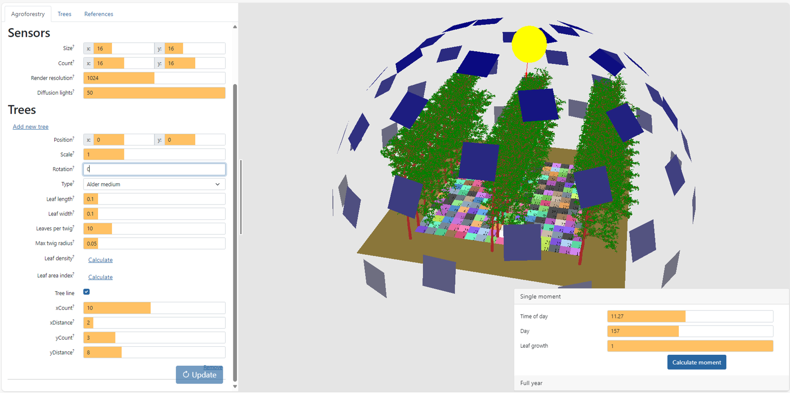
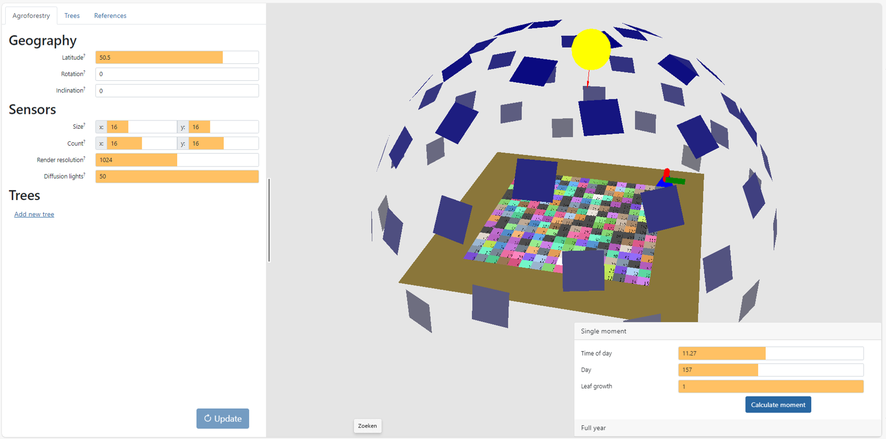

```{r, include = FALSE}
knitr::opts_chunk$set(
  collapse = TRUE,
  comment = "#>"
)
```

## First set up the correct day and time

In the [agroforestry app](https://agroforestry.ugent.be), you can select a single moment for a simulation. This moment is defined by the `Time of day`, the `Day` and the `Leaf growth` setting.

To enable easy conversion from UTC time to the corresponding input, we developed the `convert_utc_solar()` function:

```{r input, warning=FALSE, message = F}
library(tidyverse)
library(agroforlight)

datetime <- "2024-05-26 11:00:00"
convert_utc_solar(datetime = datetime, lat = 50.5, lon = 3.8)
```

## Run the 3-D calculation

The `Day` and `Time of day` settings can then be used as input for a simulation, where we assume that all leaves are present:\


Pressing `Calculate moment` will generate and download a csv file with the name `moment_157_11_100.csv`, where:

-   `moment` refers to the fact that it is a single moment simulation,
-   `157` is the `Day` setting,
-   `11` refers to the hour in which the moment is situated,
-   `100` refers to the fully developed leaves (1.0 or 100%)

We will save it here under the name `moment_157_11_100_tree.csv`.

## Run an empty scene for reference

Because the application does not provide light intensities as outputs, we should run the same field set-up, without the trees: so the same `Latitude`, `Rotation` and `Inclination` as **Geography** settings, the same `Size`, `Count`, `Render resolution` and `Diffusion lights` as **Sensor** settings, and the same `Time of day` and `Day` **Calculation** settings: 

This is a downside of the application, as it requires an additional step, but it can also serve as a quick quality check.

We will save the result of the empty scene under the name `moment_157_11_100_ref.csv`.

## Convert the app output to real-world values

Consider a measurement for global radiation of 500 W m<sup>-2</sup>, and a position on the world defined by latitude of 50.5 °N and a longitude of 3.8 °E. The latitude should be the same as provided in the <https://agroforestry.ugent.be> application.

We calculate the conversion as follows:

```{r convert_1}

TreeRows <- "moment_157_11_100_tree.csv"
converted_data <- convert_afl_1(treescene_file = TreeRows, globrad = 500, lat = 50.9, lon = 3.78)
head(converted_data)
```


This can be visualized using `ggplot2::geom_tile()`:

```{r visualise}
ggplot(data = converted_data) +
  theme_bw() +
  geom_tile(mapping = aes(x= pos_x, y= pos_y, fill = total_rad)) +
  scale_fill_viridis_c()

```

The orientation setting of the field was 0.0, which means that the x axis aligns with the North-South axis. The effect of the three tree rows, which are oriented along the x axis, is clearly visible, as the `Time of day` was 11.27, slightly before solar noon.
