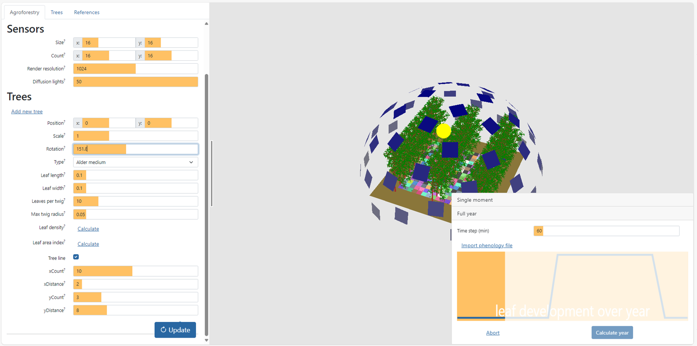

```{r, include = FALSE}
knitr::opts_chunk$set(
  collapse = TRUE,
  comment = "#>"
)
```

## Set up a phenology file

In temperate deciduous tree species, trees do not bear leaves in Winter, after which leaves appear in Spring, stay present all Summer, and fall off in Autumn. The presence of leaves has an important impact on the light interception by trees, and is therefore part of the 3-D simulation tool available on <https://agroforestry.ilvo.be/agroforlight/>. The presence of leaves is represented by a value between 0 and 1, where 0 corresponds to no leaves, and 1 corresponds to a fully developed canopy. The extent of canopy size can be adjusted using the `Trees` parameters `Leaf length`, `Leaf width`, `Leaves per twig` and `Max twig radius`. As the extent of lea development changes over the season, we provide an option to load a csv file with a time dependent leaf presence. We have developed a simple function `make_phenology_file()` that for now allows to generate a *linear* increase and decrease of leaf presence, separated by a period of fully developed canopy:

```{r setup, warning = F, message = F, include=FALSE, fig.height=4}
library(tidyverse)
library(agroforlight)
phenology <- read_delim(file = "phenology.csv", delim = ",", col_names = F)
ggplot(phenology) +
  theme_bw() +
  geom_line(mapping = aes(x= 1:366, y=phenology$X1)) +
  labs(x = "Day", y = "Leaf growth")
```

```{r setup_2, warning = F, message = F, eval=FALSE}
library(tidyverse)
library(agroforlight)

make_phenology_file("phenology.csv", doy_start_flush = 135, doy_stop_flush = 150, doy_start_fall = 300, doy_stop_fall = 320)

phenology <- read_delim(file = "phenology.csv", col_names = F, delim = ",")

ggplot(phenology) +
  theme_bw() +
  geom_line(mapping = aes(x= 1:366, y=phenology$X1), linewidth = 1) +
  labs(x = "Day", y = "Leaf growth")
```

## Run the simulation with the phenology file

We can now import the `phenology.csv` file into the application, choose the requested `Time step` (60 minutes in this example) and press `Calculate year`. The calculation progress will show as a progress bar on the orange panel:\


This calculation takes approximately 3 minutes (check if your browser uses your best GPU card) to complete and results in two files:

-   `sunlight.csv`: containing data from the direct source
-   `diffuse_light.csv`: containing data from the diffuse sources

## Convert the data
To convert the data output to actual light intensities, we now need a time series of radiation measurements. In this example, we have data at a ten min interval for an entire year 2020:

```{r readraddata}

ggplot(example_data) + 
  theme_bw() +
  geom_line(mapping = aes(x=datetime, y=radiation), linewidth = 1.0)
```

We then run the function `convert_afl_ts()` to convert the output in m<sup>-2</sup> into W m<sup>-2</sup>. Thereto, we provide the output of the 3D simulation (`treescene_dir_file = "sunlight.csv"` and `treescene_diff_file = "diffuse_light.csv"`), the radiation data (`datetime = example_data$datetime and globrad = example_data$radiation`), and the settings of the simulation (`lat = 50.9, lon = 3.78, sensor_size = 1, inclination = 0, rotation = 0`). As we are not interested in the particular direct and diffuse components, we set the `out_components` argument at `FALSE`:

```{r convert_1}
converted_data <- convert_afl_ts(treescene_dir_file = "sunlight.csv",
                                 treescene_diff_file = "diffuse_light.csv",
                                 datetime = example_data$datetime, globrad = example_data$radiation,
                                 lat = 50.9, lon = 3.78, 
                                 sensor_size = 1, inclination = 0, rotation = 0, out_components = F)
head(converted_data)

```

## Aggregate and visualize

Light distribution pattern for three time points during the year: 

-   around noon on 21 February (doy = 52)
-   around noon on 21 April (doy = 112)
-   around noon on 28 June (doy = 180)

```{r distrib, fig.height=12}

converted_data %>%
  # filter(between(pos_x, -3.5, 3.5)) %>%
  mutate(doy = yday(datetime)) %>%
  filter(doy %in% c(52, 112, 180)) %>%
  filter(hour(datetime) == 13) %>%
  ggplot() +
  theme_bw() +
  facet_wrap(facets = vars(doy), nrow = 3) +
  geom_tile(aes(x= pos_y, y=pos_x, fill = total_rad)) +
  scale_fill_viridis_c()

```

Remove edge effects: `filter(between(pos_x, -1.5, 1.5))` 

```{r aggregate}
converted_data %>%
  filter(between(pos_x, -1.5, 1.5)) %>%
  mutate(doy = yday(datetime)) %>%
  filter(between(datetime, as_datetime("2020-06-28 09:00:00"), as_datetime("2020-06-28 14:00:00")), between(pos_y, -8, 0)) %>%
  group_by(pos_y, datetime) %>%
  reframe(total_rad = mean(total_rad)) %>%
  ggplot() +
  theme_bw() +
  geom_line(aes(x= pos_y, y=total_rad, color = as.factor(datetime), group = as.factor(datetime)), linewidth = 1)+
  scale_fill_viridis_d() +
  theme(legend.position = 'top')

```

